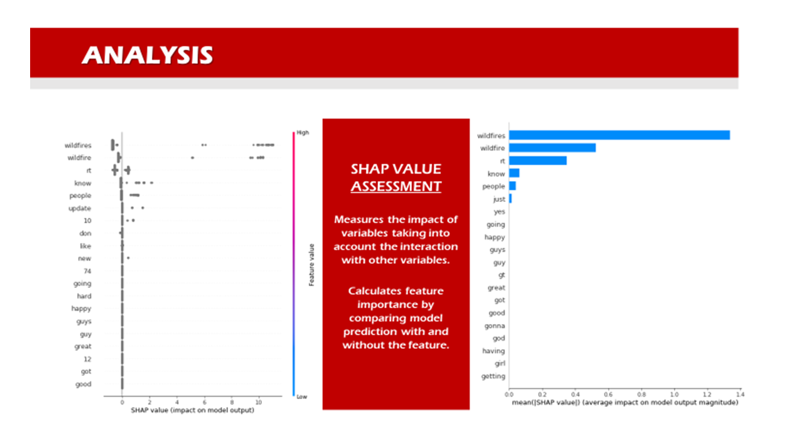
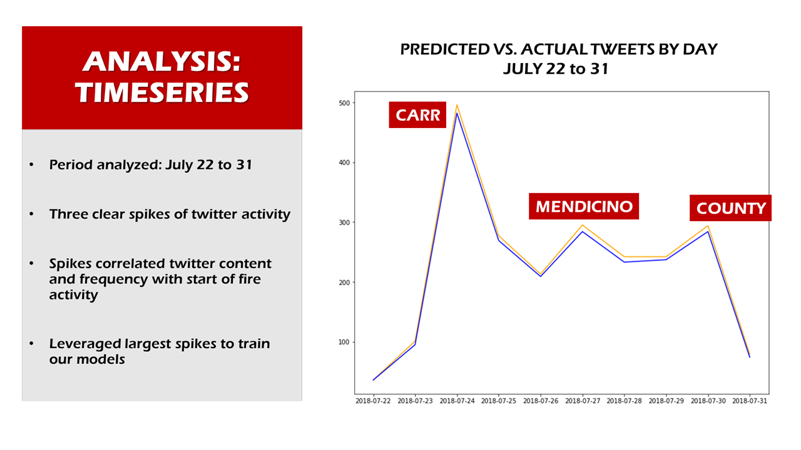

# DISASTER ALERT PROJECT

## EXECUTIVE SUMMARY 

**PROBLEM STATEMENT**

Traditionally, when natural disasters occur the public relies heavily on communication from government based emergency response systems, emergency response services, and news outlets to communicate the incident, its scope, and any ongoing instructions or relevant information to the public.  

The rise of social media in our society has offered a new opportunity to not only communicate the news after an disastrous event has occurred, but given the nature of trending topics on social media, to potentially generate awareness of the event as the incident begins and unfolds - eliminating the lag time between communication from first responders, government outlets, or reporters accessing the scene.

The data science problem that we are attempting to address: Is it possible to identify a disastrous event (wildfire, Earthquake, Hurricane, Tornado, etc.) when it first occurs in a given location based on content and frequency of social media activity, and once a threshold has been satisfied can that data then be harnessed to communicate an alert through an app of some form?

**OUR TEAM**

- Susan Chen
    - [GitHub](https://git.generalassemb.ly/susan2019)
    - [LinkedIn](https://www.linkedin.com/in/xue-susan-chen)

- Bryan Pfalzgraf
    - [GitHub](https://git.generalassemb.ly/bpfalz)
    - [LinkedIn](https://www.linkedin.com/in/bryanpfalzgraf)

- Tony Bosco
    - [GitHub](https://git.generalassemb.ly/Boscobrand)
    - [LinkedIn](https://www.linkedin.com/in/tonybosco)

**OUR OBJECTIVES**

- Capture social media posts on a single disastrous event
- Study the resulting data and identify the unique characteristics surrounding an the instance of an emergency event
    - Deploy Natural Language Processing and Text Feature Extraction to evaluate keywords
    - Assess frequency of posts and impact during time period (before, instance, after event)
- Construct several classification models and evaluate for accuracy of predictions
- Identify the means by which an alert can be implemented 

**EXECUTIVE SUMMARY**

*Step 1: Select Social Media Platform*

Our first step was to decide upon which social media type would be most effective to test.  We were looking for a platform we could access that would provide us with enough universal history around each event and enough depth of text to evaluate.  With Instagram being too picture intensive and Facebook being complicated to access, we ultimately decided to focus in on evaluating Twitter posts for this project. While we all accessed Twitter APIs and began the long, limited process of scraping data, our research also uncovered that Internet Archive, a non-profit digital library, had curated an online collection of disaster related tweets which we tapped for evaluation.  This provided us with immediate access to downloadable files providing over 1 million general tweets a day during the key time periods we were interested in.    

*Step 2: Identify Prototypical Disaster Incident*

Our second step was to identify a single disaster event that we could evaluate thoroughly, with an eye toward scaling up to include other events later.  After deliberation, we decided to focus on the California Wildfire events that occurred during the week of July 22, 2018, specifically the Carr Fire:

> "The largest fire to start in 2018, the Carr fire has already engulfed more than 110,000 acres (roughly seven times the size of Manhattan) and is only 27 percent contained. More than 800 homes have been consumed, and about 3,400 firefighting personnel are on the scene to try to control the blaze. By the end of last week, the Carr fire started to produce “fire vortexes,” which are basically fire tornadoes that can jump over roads and rivers. As the hot air from the fire rises, it swirls into a plume that spews carbon monoxide and creates its own weather system."

> Source: "The Worst Fires in Recent California History" by April Glaser  
> https://slate.com/technology/2018/07/california-wildfires-a-timeline-of-the-biggest-blazes-in-recent-history.html

We arrived at this decision based on our understanding of increased social media coverage of these events, what we believed would be able to mine from the Internet Archive database, and our ability to isolate the incident to a fixed geographic target.

*Step 3: Establish Workflow for Construction of Models and Identify "Instance of Alert"*

Once our dataset was obtained, contained, and cleaned, we moved on to our third step - creating an overall preliminary workflow for expressing our data through modelling and forecasting an alert:

Our theory going into the project was that we should be able to create a model that would reflect what we referred as the "characteristics of a signal", which would be comprised of both validation of posts against an established list of keywords utilized to identify the event and an understanding of the rate of tweets coming out of a location before, during and after the incident.  

Based on the data gathered, we were able to produce a 6600 observation dataset to train on, consisting of 600 tweets that were labelled positive for our wildfire keyword set, and 6000 posts that were labelled negative (containing no mention of wildfire).  This set was built specifically upon two days of the first week of the Carr fire from July 23 to 24, 2018.

We reviewed and decided upon six models to review for our project (as indicated in the above workflow diagram).  Our strategy was to take the highest performing model of the six, and apply two additional test sets to that model.  The additional test sets were constructed from Feb 3, 2019 when there were no references or posts about wildfires and July 22-30, 2018 when there was a significant amount of twitter activity surrounding the wildfire.  This provided us with a simulation of our ability to identify an incident among twitter posts during inactive and an active scenarios.  

In addition, we reviewed our data in a time series analysis to understand our success rate in identifying relevant posts per hour, day and week based on our model.  This helped us to pinpoint the thresholds of when an event was occurring during a given timeframe based on positive posts, and an understanding as to how many tweets per hour could constitute normal activity, warning activity, or event level activity.

#### FINAL CONCLUSIONS AND RECOMMENDATIONS 

*1. MODEL PERFORMANCE*

In comparison, our first five models performed extraordinarily well and on par with each other (please see graphic below).  After further discussion, based on their scores the team decided against pursuing a Voter Classification Model and instead selected the XGBoost model to move forward with for additional evaluation against our different test sets.  Among all models, our XGBoost model demonstrated the optimum minimum value of false negatives and false positives. 

*2. SIGNAL SUMMARY - FLIPPING THE SWITCH*

Based on our analysis, we confirmed that we could effectively partner the two tasks of monitoring content that could trigger an alert through:
- A set of keywords utilized to carefully define a natural disaster event
- A monitor of the rate of positive tweets associated with these keywords over time

Our findings created a two part formula that can be extended to other natural disaster incidents/events with the addition of classes of event specific keywords (around earthquake, flood, hurricane, etc.) to identify related content and the rate thresholds that positively associated tweets would need to cross in order to "flip a switch" and signal an alert.

*3. RECOMMENDATIONS MOVING FORWARD*

**ADDITION OF LOCATION/GEOCODES** 

Twitter does become difficult when trying to pinpoint a key location, since not all twitter users elect to share their location at the time of the event.  In studies performed on this topic in the past, some studies elected to utilize a nearby wi-fi signal if it was indicated as part of the data set surrounding the post, while others randomly married coordinates to tweets.  This data was not universally available through the Internet Archive curated collection of tweets.  Our team believes in keeping the data pure, and we were uncomfortable simulating a location that may/may not be tied to a specific area of response.  If, however, that data can be universally obtained and validated from a social media platform, it would be an asset to the alert.

**BUILD OUT CATEGORY MODULES FOR OTHER NATURAL DISASTERS**

It is vitally important for each set of keywords for an event to be carefully selected and tested.  The keyword terminology used in this model was researched, debated, and tested before being subjected to our tests on our final selected model.  The same selective approach should be taken with each of the natural disaster events considered in expanding this program.
    
    

**CONNECTING THE MODEL TO AN APP BASED DASHBOARD FOR REAL TIME ASSESSMENT AND ALERTS**

With more time in development, our next phase would be to connect our model to an app or web-based dashboard that could freely monitor the twitter stream and indicate when confirmed positive posts were reaching warning and crisis levels to trigger the alert.  Ideally, with the addition of location information, we would seek to build an active filter that could drill down on location as alerts rise to threshold levels.

#### CONTENTS

- CODE NOTEBOOKS
    - Logistic Regression
    - Naive Bayes
    - Random Forest
    - XG Boost
    - SVM
    - TimeSeries
    - TimeSeries(2-4)
- DATAFILES
- PRESENTATION
- IMAGES
   
#### SOURCE DOCUMENTATION

- training_set_withtime.csv

*Source: "The Worst Fires in Recent California History" by April Glaser*    
https://slate.com/technology/2018/07/california-wildfires-a-timeline-of-the-biggest-blazes-in-recent-history.html

*Source: Insurance Information Institute: "Facts + Statistics: Wildfires"*    
https://www.iii.org/fact-statistic/facts-statistics-wildfires

*Source: Internet Archive Access for Twitter Collections*              
https://archive.org/search.php?query=creator%3A%22Internet+Archive%22
